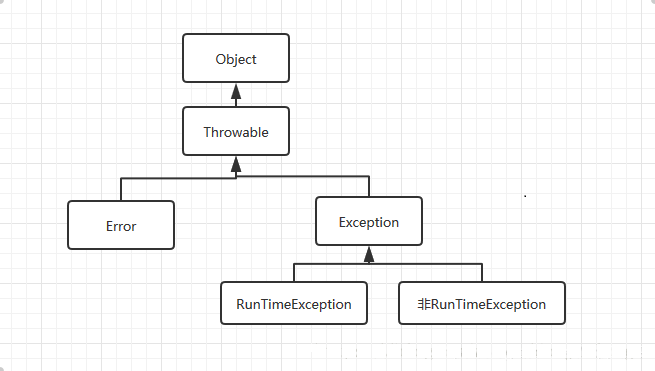

## 说明
### 1. Error和Exception区分
Error是编译时错误和系统错误，系统错误在除特殊情况下，都不需要你来关心，基本不会出现。而编译时错误，如果你使用了编译器，那么编译器会提示。

Exception则是可以被抛出的基本类型，我们需要主要关心的也是这个类。
Exception又分为RunTimeException和其他Exception。

### 2. RunTimeException和非RunTimeException区分
- 非RunTimeException：受检查异常

可以理解为错误，必须要开发者解决以后才能编译通过，解决的方法有两种：

1. throw到上层

2. try-catch处理

- RunTimeException：运行时异常

又称不受检查异常，因为不受检查，所以在代码中可能会有RunTimeException时Java编译检查时不会告诉你有这个异常，但是在实际运行代码时则会暴露出来，比如经典的1/0、空指针等。如果不处理也会被Java自己处理。

### 异常的分类

- Error：一般为底层的不可恢复的

- Exception：分为未检查异常(RuntimeException)和已检查异常(非RuntimeException)

未检查异常是因为程序员没有进行必需要的检查，因为疏忽和错误而引起的错误。几个经典的RunTimeException如下：

1. java.lang.NullPointerException

2. java.lang.ArithmaticException

3. java.lang.ArrayIndexoutofBoundsException

### Runtime Exception
在定义方法时不需要声明会抛出runtime exception， 在调用这个方法时不需要捕获这个runtime exception。

runtime exception是从java.lang.RuntimeException或java.lang.Error类衍生出来的，例如：nullpointexception，IndexOutOfBoundsException就属于runtime exception。

### Exception
定义方法时必须声明所有可能会抛出的exception； 在调用这个方法时，必须捕获它的checked exception，不然就得把它的exception传递下去；exception是从java.lang.Exception类衍生出来的。例如：IOException，SQLException就属于Exception。

Exception 属于应用程序级别的异常，这类异常必须捕捉,Exception体系包括RuntimeException体系和其他非RuntimeException的体系。

RuntimeException 表示系统异常，比较严重，如果出现RuntimeException，那么一定是程序员的错误。

### unchecked异常
即RuntimeException（运行时异常），不需要 try…catch… 或 throws 机制去处理的异常。
