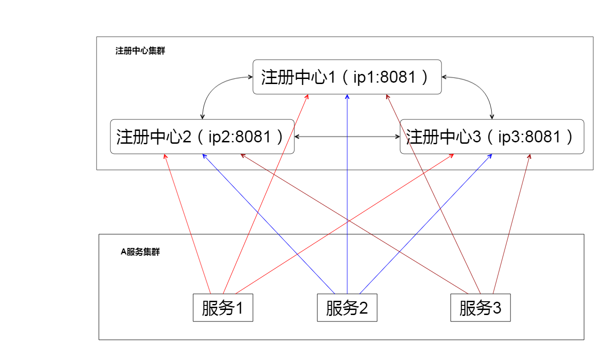

1. 注册中心集群

注册中心集群里的各个注册中心相互注册，比如 "注册中心2(192.168.0.12)" 的配置文件：
```
server.port=8081

spring.application.name=regcenter-server

eureka.instance.perferIpAddress=true

eureka.instance.hostname=192.168.0.12

eureka.server.enable-self-preservation=false

eureka.server.eviction-interval-timer-in-ms=5000

eureka.client.registerWithEureka=false

eureka.client.fetchRegistry=false

eureka.client.serviceUrl.defaultZone=http://192.168.0.11:8081/eureka/,http://192.168.0.13:8081/eureka/
```

**重点是 eureka.instance.hostname 和 eureka.client.serviceUrl.defaultZone 。**

当业务服务通过 rest 请求向注册中心注册的时候，注册中心会检测是否有其他的注册中心，如果有，它会将请求转发到其他相连的注册中心，从而实现注册中心之间的服务同步。通过服务同步，服务提供者的服务信息就能被任何一台注册中心调用到。

 2. 服务集群

服务集群里的各个服务向各个注册中心注册：
```
server.port=8085

spring.application.name=auth-server

eureka.client.serviceUrl.defaultZone=http://192.168.0.11:8081/eureka/,http://192.168.0.12:8081/eureka/,http://192.168.0.13:8081/eureka/
```
