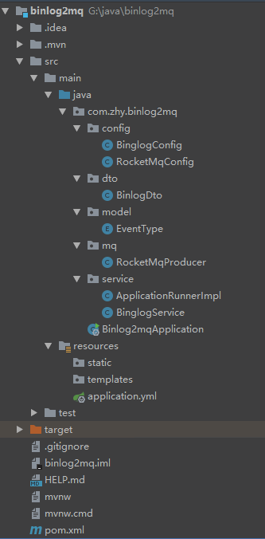

# binlog2mq项目结构


# 主要代码
## 添加maven依赖
```xml
<dependency>
    <groupId>com.github.shyiko</groupId>
    <artifactId>mysql-binlog-connector-java</artifactId>
    <version>0.20.1</version>
</dependency>
<dependency>
    <groupId>com.alibaba</groupId>
    <artifactId>fastjson</artifactId>
    <version>1.2.62</version>
</dependency>
<dependency>
    <groupId>org.apache.rocketmq</groupId>
    <artifactId>rocketmq-client</artifactId>
    <version>4.5.2</version>
</dependency>
```

## application.yml
```
spring:
  application:
    name: binglog2mq
server:
  port: 8085

rocketmq:
  host: 192.168.0.2:9876
  tags: '*'
  producer:
    group: binlog

binglog:
  host: 192.168.0.1
  port: 3306
  user: root
  password: root
  table: test.student,test.course
```

## 数据传输对象
```java
@Data
public class BinlogDto {
    private Integer event;
    private Object data;

    public BinlogDto(Integer event, Object data) {
        this.event = event;
        this.data = data;
    }
}
```

## 注册binlog监听事件
```java
@Service
public class BinglogService {
    @Autowired
    private BinaryLogClient client;
    @Autowired
    private RocketMqProducer mqProducer;
    @Autowired
    private List<String> table;
    private ConcurrentHashMap<Long, String> tableMap = new ConcurrentHashMap<>();

    @Async
    public void run() throws IOException {
        // 注册监听事件
        client.registerEventListener(event -> {
            EventData data = event.getData();
            if (data == null) {
                return;
            }
            if (data instanceof TableMapEventData) {
                TableMapEventData tableMapEventData = (TableMapEventData) data;
                String value = tableMapEventData.getDatabase() + "_" + tableMapEventData.getTable();
                if (!table.contains(value)) {
                    return;
                }
                tableMap.put(tableMapEventData.getTableId(), value);
            }
            if (data instanceof UpdateRowsEventData) { // update
                UpdateRowsEventData updateRowsEventData = (UpdateRowsEventData) data;
                String topic = tableMap.get(updateRowsEventData.getTableId());
                for (Map.Entry<Serializable[], Serializable[]> row : updateRowsEventData.getRows()) {
                    send(topic, new BinlogDto(EventType.UPDATE.getCode(), row.getValue()));
                }
            } else if (data instanceof WriteRowsEventData) { // insert
                WriteRowsEventData writeRowsEventData = (WriteRowsEventData) data;
                String topic = tableMap.get(writeRowsEventData.getTableId());
                for (Serializable[] row : writeRowsEventData.getRows()) {
                    send(topic, new BinlogDto(EventType.INSERT.getCode(), row));
                }
            } else if (data instanceof DeleteRowsEventData) { // delete
                DeleteRowsEventData deleteRowsEventData = (DeleteRowsEventData) data;
                String topic = tableMap.get(deleteRowsEventData.getTableId());
                for (Serializable[] row : deleteRowsEventData.getRows()) {
                    send(topic, new BinlogDto(EventType.DELETE.getCode(), row));
                }
            }
        });
        client.connect();
    }

    private void send(String topic, BinlogDto binlogDto) {
        String msg = JSON.toJSONString(binlogDto);
        mqProducer.send(topic, msg);
    }
}
```
