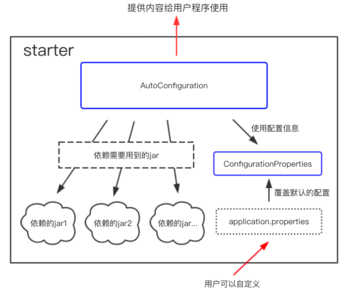

# 自定义starter

## starter的理念
starter会把所有用到的依赖都给包含进来，避免了开发者自己去引入依赖所带来的麻烦。需要注意的是不同的starter是为了解决不同的依赖，所以它们内部的实现可能会有很大的差异，例如jpa的starter和Redis的starter可能实现就不一样，这是因为starter的本质在于synthesize，这是一层在逻辑层面的抽象，也许这种理念有点类似于Docker，因为它们都是在做一个“包装”的操作，如果你知道Docker是为了解决什么问题的，也许你可以用Docker和starter做一个类比。

## starter的实现
虽然不同的starter实现起来各有差异，但是他们基本上都会使用到两个相同的内容：ConfigurationProperties和AutoConfiguration。因为Spring Boot坚信“约定大于配置”这一理念，所以我们使用ConfigurationProperties来保存我们的配置，并且这些配置都可以有一个默认值，即在我们没有主动覆写原始配置的情况下，默认值就会生效，这在很多情况下是非常有用的。除此之外，starter的ConfigurationProperties还使得所有的配置属性被聚集到一个文件中（一般在resources目录下的application.properties），这样我们就告别了Spring项目中XML地狱。

## starter的整体逻辑


## Starter原理
1. SpringBoot 在启动时会去依赖的starter包中寻找 resources/META-INF/spring.factories文件（通过autoconfigure 管理,通过服务中的springboot main 启动中@EnableAutoConfiguration（@SpringBootApplication）引入），然后根据文件中配置的Jar包去扫描项目所依赖的Jar包，这类似于 Java 的 SPI 机制。

2. 根据 spring.factories配置加载AutoConfigure类。

3. 根据 @Conditional注解的条件，进行自动配置并将Bean注入Spring Context 上下文当中。也可以使用@ImportAutoConfiguration({MyServiceAutoConfiguration.class}) 指定自动配置哪些类。

## 创建自己的Spring Boot Starter
1. 创建starter项目，注意项目的命名规范

2. 创建ConfigurationProperties用于保存配置信息（application.properties）

3. 创建业务类

4. 创建AutoConfiguration，引用定义好的配置信息，并将满足条件(@ConditionalOnXxx)的业务类注入到Spring容器中(Spring Context)

5. 把AutoConfiguration类加入spring.factories配置文件中进行声明

6. 打包项目，之后在另一个SpringBoot项目中引入该项目依赖，然后就可以使用该starter了

### 创建maven工程（maven-archetype-quickstart）

- Spring官方Starter通常命名为spring-boot-starter-{name}如 spring-boot-starter-web

- Spring官方建议非官方Starter命名应遵循{name}-spring-boot-starter的格式, 如mybatis-spring-boot-starter

### 删除启动类（包含main方法的类）

### 引入依赖
```xml
  <groupId>com.zhy</groupId>
  <artifactId>helloworld-spring-boot-starter</artifactId>
  <version>1.0-SNAPSHOT</version>
  
  <dependencies>
    <dependency>
      <groupId>org.springframework.boot</groupId>
      <artifactId>spring-boot-autoconfigure</artifactId>
      <version>2.0.0.RELEASE</version>
    </dependency>
    <dependency>
      <groupId>org.springframework.boot</groupId>
      <artifactId>spring-boot-configuration-processor</artifactId>
      <version>2.0.0.RELEASE</version>
      <optional>true</optional>
    </dependency>
    <dependency>
      <groupId>org.projectlombok</groupId>
      <artifactId>lombok</artifactId>
      <version>1.18.6</version>
      <scope>provided</scope>
    </dependency>
  </dependencies>
```

### 创建proterties类来保存application.properties配置文件信息
```java
@ConfigurationProperties(prefix = "spring.person")
@Data
public class PersonProperties {
    private String name;
    private int age;
    private String sex = "M";
}
```

### 创建业务类
```java
public class PersonService {
    private PersonProperties properties;

    public PersonService(PersonProperties properties) {
        this.properties = properties;
    }

    public void sayHello(){
        System.out.println("Hello，my name is: " + properties.getName() + ", age is: " + properties.getAge() + "years"
                + ", sex is: " + properties.getSex());
    }
}
```

### 创建AutoConfiguration
```java
@Configuration
@EnableConfigurationProperties(PersonProperties.class)
@ConditionalOnClass(PersonService.class)
@ConditionalOnProperty(prefix = "spring.person", value = "enabled", matchIfMissing = true)
public class PersonAutoConfiguration {

    @Autowired
    private PersonProperties properties;

    @Bean
    @ConditionalOnMissingBean(PersonService.class)  // 当容器中没有指定Bean的情况下，自动配置PersonService类
    public PersonService personService(){
        PersonService personService = new PersonService(properties);
        return personService;
    }
}
```
- @ConditionalOnClass：当类路径classpath下有指定的类的情况下进行自动配置

- @ConditionalOnMissingBean: 当容器(Spring Context)中没有指定Bean的情况下进行自动配置

- @ConditionalOnProperty(prefix = “example.service”, value = “enabled”, matchIfMissing = true): 当配置文件中example.service.enabled=true时进行自动配置，如果没有设置此值就默认使用matchIfMissing对应的值

- @ConditionalOnMissingBean: 当Spring Context中不存在该Bean时

- @ConditionalOnBean: 当容器(Spring Context)中有指定的Bean的条件下

- @ConditionalOnMissingClass: 当类路径下没有指定的类的条件下

- @ConditionalOnExpression: 基于SpEL表达式作为判断条件

- @ConditionalOnJava: 基于JVM版本作为判断条件

- @ConditionalOnJndi: 在JNDI存在的条件下查找指定的位置

- @ConditionalOnNotWebApplication: 当前项目不是Web项目的条件下

- @ConditionalOnWebApplication: 当前项目是Web项目的条件下

- @ConditionalOnResource: 类路径下是否有指定的资源

- @ConditionalOnSingleCandidate: 当指定的Bean在容器中只有一个，或者在有多个Bean的情况下，用来指定首选的Bean

- @ConfigurationProperties: 主要用来把properties配置文件转化为对应的XxxProperties来使用的,并不会把该类放入到IOC容器中，如果想放入到容器中可以在XxxProperties上使用@Component来标注，也可以使用@EnableConfigurationProperties(XxxProperties.class)统一配置到Application上来，这种方式可以在Application上来统一开启指定的属性，这样也没必要在每个XxxProperties上使用@Component

- @EnableConfigurationProperties(XxxProperties.class): 使@ConfigurationProperties注解生效。如果只配置@ConfigurationProperties注解，在IOC容器中是获取不到properties配置文件转化的bean的

### 新建 spring.factories 文件
新建文件src/main/resources/META-INF/spring.factories
```
org.springframework.boot.autoconfigure.EnableAutoConfiguration=com.zhy.PersonAutoConfiguration
```

### 打包mvn clean install

### 创建一个Spring Boot工程并引入依赖
```xml
<dependency>
  <groupId>com.zhy</groupId>
  <artifactId>helloworld-spring-boot-starter</artifactId>
  <version>1.0-SNAPSHOT</version>
</dependency>
```

### 配置application.yml
```
spring:
  person:
    name: abc
    age: 20
```

### 单元测试
```java
@RunWith(SpringRunner.class)
@SpringBootTest
public class ComponentApplicationTests {

    @Autowired
    private PersonService personService;
    
    @Test
    public void contextLoads() {
        personService.sayHello();
    }
}
```
