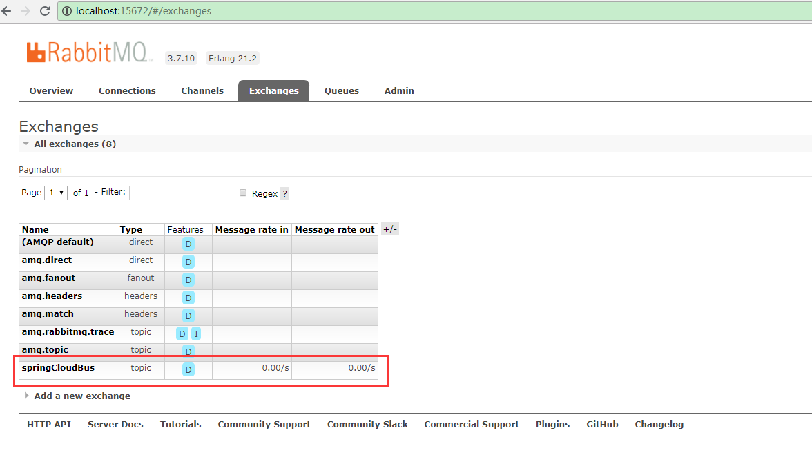
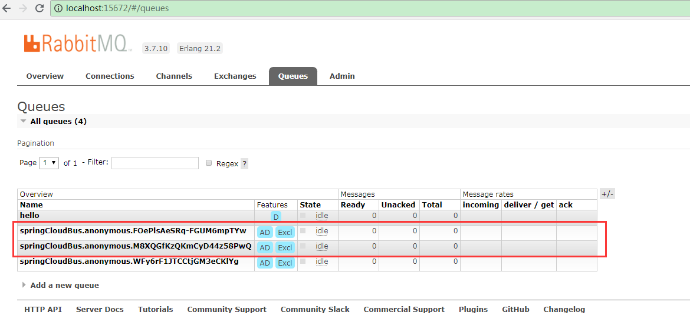
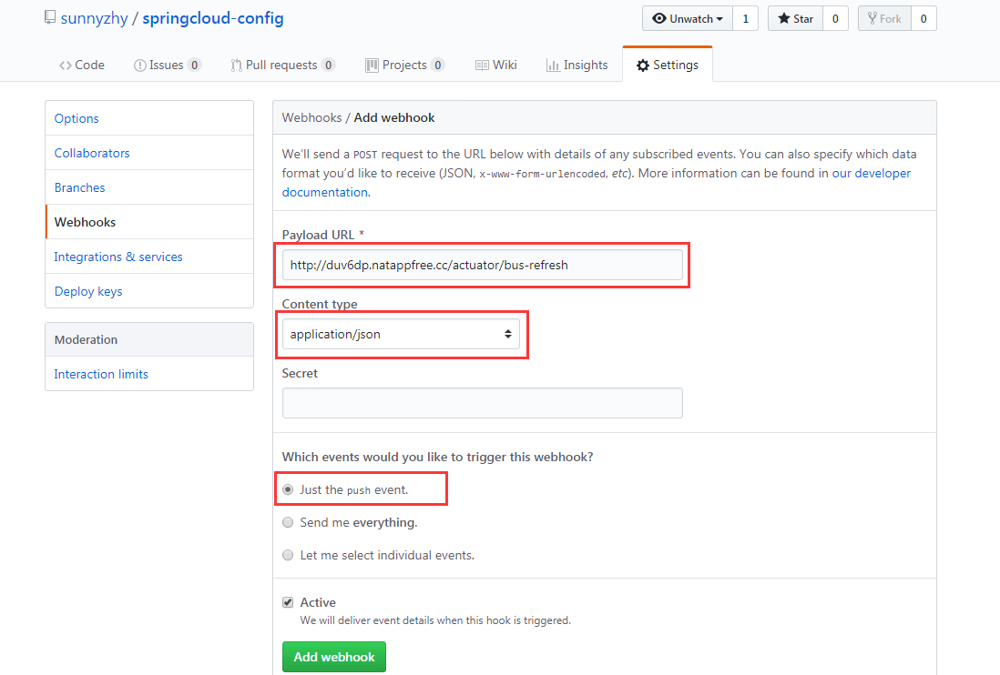

# Config Server
## pom.xml
```xml

        <dependency>
            <groupId>org.springframework.cloud</groupId>
            <artifactId>spring-cloud-config-server</artifactId>
            <version>2.0.2.RELEASE</version>
        </dependency>
        <dependency>
            <groupId>org.springframework.cloud</groupId>
            <artifactId>spring-cloud-starter-netflix-eureka-client</artifactId>
            <version>2.0.2.RELEASE</version>
        </dependency>
        <dependency>
            <groupId>org.springframework.boot</groupId>
            <artifactId>spring-boot-starter-actuator</artifactId>
        </dependency>
        <dependency>
            <groupId>org.springframework.cloud</groupId>
            <artifactId>spring-cloud-starter-bus-amqp</artifactId>
            <version>2.0.0.RELEASE</version>
        </dependency>
```

## application.yml
```
server:
  port: 8090
spring:
  application:
    name: springcloud-config-server
  rabbitmq:
    host: 127.0.0.1
    username: admin
    password: admin
  cloud:
    config:
      server:
        git:
          uri: https://github.com/sunnyzhy/springcloud-config.git
          username: sunnyzhy
          password: ******
eureka:
  client:
    service-url:
      defaultZone: http://localhost:9010/eureka/
management:
  endpoints:
    web:
      exposure:
        include: '*'
```

## 启动服务
访问 http://localhost:15672 ，可以看到交换机中多出一列



而队列中多出一列


# Config Client
## pom.xml
```xml
        <dependency>
            <groupId>org.springframework.cloud</groupId>
            <artifactId>spring-cloud-starter-config</artifactId>
            <version>2.0.2.RELEASE</version>
        </dependency>
        <dependency>
            <groupId>org.springframework.cloud</groupId>
            <artifactId>spring-cloud-starter-netflix-eureka-client</artifactId>
            <version>2.0.2.RELEASE</version>
        </dependency>
        <dependency>
            <groupId>org.springframework.boot</groupId>
            <artifactId>spring-boot-starter-actuator</artifactId>
        </dependency>
        <dependency>
            <groupId>org.springframework.cloud</groupId>
            <artifactId>spring-cloud-starter-bus-amqp</artifactId>
            <version>2.0.0.RELEASE</version>
        </dependency>
```

## application.yml
```
server:
  port: 8091
spring:
  application:
    name: cloud-config
  rabbitmq:
    host: 127.0.0.1
    username: admin
    password: admin
```

## 启动服务
开启两个客户端服务（端口分别为8091、8092），访问 http://localhost:15672 ，可以看到队列中多出两列



1. 访问http://localhost:8091/get ,显示如下内容

```
dev-1.1
```

2. 访问http://localhost:8092/get ,显示如下内容

```
dev-1.1
```

3. 在git仓库中修改version的值为dev-1.2

4. 在**Config Server**端，用REST Client发送post请求http://localhost:8090/actuator/bus-refresh

5. 访问http://localhost:8091/get ,显示如下内容

```
dev-1.2
```

6. 访问http://localhost:8092/get ,显示如下内容

```
dev-1.2
```

7. 此时并没有重启服务，获取的配置内容却已经自动刷新了。但是如果每次都要手动去向配置服务发送 post 请求的话，那么也不太可取。这个时候就可以利用 **GitHub 的 Webhooks**。

# Webhook
## 概述
Webhook是一种web回调或者http的push API，是向APP或者其他应用提供实时信息的一种方式。Webhook在数据产生时立即发送数据，也就是能实时收到数据。这一种不同于典型的API，需要用了实时性需要足够快的轮询。这无论是对生产还是对消费者都是高效的，唯一的缺点是初始建立困难。

Webhook有时也被称为反向API，因为他提供了API规则，你需要设计要使用的API。Webhook将向你的应用发起http请求，典型的是post请求，应用程序由请求驱动。

Github上对Webhook的描述
```
Webhooks allow external services to be notified when certain events happen. When the specified events happen, we’ll send a POST request to each of the URLs you provide. 
```

## 配置


