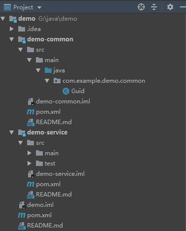

## 1. 首先创建一个主工程 demo，选择File -> new -> Project，选择Spring Initializr，不要选择依赖项
1. 删除 demo 中的以下文件:
   - .mvn（文件夹）
   - src（文件夹）
   - .gitignore
   - mvnw
   - mvnw.cmd

2. 在 demo 的 pom.xml 文件中，把打包方式修改为 pom 
```xml
<packaging>pom</packaging>
```

3. 把 demo 安装到本地的 Maven 仓库

## 2. 新建子工程 demo-common（工具类），选中主工程 demo -> 右键 -> New -> Module，选择Spring Initializr，然后选择需要的依赖项
1. 删除 demo-common 中的以下文件:
   - .mvn（文件夹）
   - .gitignore
   - mvnw
   - mvnw.cmd
   - resources（文件夹）
   - test（文件夹）
   - DemoCommonApplication（启动类）

2. 修改 demo-common 的 pom.xml 文件，把 parent 标签里面的内容改成主工程的信息
```xml
<parent>
    <groupId>com.example</groupId>
    <artifactId>demo</artifactId>
    <version>0.0.1-SNAPSHOT</version>
    <relativePath/> <!-- lookup parent from repository -->
</parent>
```

3. 在 demo 的 pom.xml 文件中，添加子工程模块
```xml
<modules>
    <module>demo-common</module>
</modules>
```

## 3. 新建子工程 demo-service，选中主工程 demo -> 右键 -> New -> Module，选择Spring Initializr，然后选择需要的依赖项
1. 删除 demo-service 中的以下文件:
   - .mvn（文件夹）
   - .gitignore
   - mvnw
   - mvnw.cmd

2. 修改 demo-service 的 pom.xml 文件，把 parent 标签里面的内容改成主工程的信息
```xml
<parent>
    <groupId>com.example</groupId>
    <artifactId>demo</artifactId>
    <version>0.0.1-SNAPSHOT</version>
    <relativePath/> <!-- lookup parent from repository -->
</parent>
```

3. 修改 demo-service 的 pom.xml 文件，添加依赖项 demo-common
```xml
<dependency>
    <groupId>com.example</groupId>
    <artifactId>demo-common</artifactId>
    <version>0.0.1-SNAPSHOT</version>
</dependency>
```

4. 在 demo 的 pom.xml 文件中，添加子工程模块
```xml
<modules>
    <module>demo-common</module>
    <module>demo-service</module>
</modules>
```

## 4. 工程结构


## 5. Maven 结构


## 6. 主工程和各子工程的pom.xml配置
```xml
<!-- 主工程 demo 的 pom.xml 配置 -->
<?xml version="1.0" encoding="UTF-8"?>
<project xmlns="http://maven.apache.org/POM/4.0.0" xmlns:xsi="http://www.w3.org/2001/XMLSchema-instance"
         xsi:schemaLocation="http://maven.apache.org/POM/4.0.0 https://maven.apache.org/xsd/maven-4.0.0.xsd">
    <modelVersion>4.0.0</modelVersion>
    <parent>
        <groupId>org.springframework.boot</groupId>
        <artifactId>spring-boot-starter-parent</artifactId>
        <version>2.2.2.RELEASE</version>
        <relativePath/> <!-- lookup parent from repository -->
    </parent>
    <groupId>com.example</groupId>
    <artifactId>demo</artifactId>
    <version>0.0.1-SNAPSHOT</version>
    <name>demo</name>
    <description>Demo project for Spring Boot</description>

    <packaging>pom</packaging> <!-- 把打包方式修改为 pom  -->

    <properties>
        <java.version>1.8</java.version>
        <maven.compiler.plugin.version>3.8.1</maven.compiler.plugin.version>
    </properties>

    <!-- 添加项目子模块 -->
    <modules>
        <module>demo-common</module>
        <module>demo-service</module>
    </modules>

    <dependencies>
        <dependency>
            <groupId>org.springframework.boot</groupId>
            <artifactId>spring-boot-starter</artifactId>
        </dependency>

        <dependency>
            <groupId>org.springframework.boot</groupId>
            <artifactId>spring-boot-starter-test</artifactId>
            <scope>test</scope>
            <exclusions>
                <exclusion>
                    <groupId>org.junit.vintage</groupId>
                    <artifactId>junit-vintage-engine</artifactId>
                </exclusion>
            </exclusions>
        </dependency>
    </dependencies>

    <build>
        <plugins>
            <!-- 把编译插件修改为 maven 编译插件 -->
            <plugin>
                <groupId>org.apache.maven.plugins</groupId>
                <artifactId>maven-compiler-plugin</artifactId>
                <version>${maven.compiler.plugin.version}</version>
                <configuration>
                    <source>${java.version}</source>
                    <target>${java.version}</target>
                </configuration>
            </plugin>
        </plugins>
    </build>
</project>
```

```xml
<!-- 子工程 demo-common 的 pom.xml 配置 -->
<?xml version="1.0" encoding="UTF-8"?>
<project xmlns="http://maven.apache.org/POM/4.0.0" xmlns:xsi="http://www.w3.org/2001/XMLSchema-instance"
         xsi:schemaLocation="http://maven.apache.org/POM/4.0.0 https://maven.apache.org/xsd/maven-4.0.0.xsd">
    <modelVersion>4.0.0</modelVersion>
    
    <!-- 继承主工程 -->
    <parent>
        <groupId>com.example</groupId>
        <artifactId>demo</artifactId>
        <version>0.0.1-SNAPSHOT</version>
        <relativePath/> <!-- lookup parent from repository -->
    </parent>
    
    <groupId>com.example</groupId>
    <artifactId>demo-common</artifactId>
    <version>0.0.1-SNAPSHOT</version>
    <name>demo-common</name>
    <description>Demo project for Spring Boot</description>

    <!-- maven 可以继承主工程中的参数，所以可以删除子模块中的定义 -->
    <properties>
<!--        <java.version>1.8</java.version>-->
    </properties>

    <!-- maven 可以继承主工程中的依赖，所以可以删除子模块中的定义 -->
    <dependencies>
<!--        <dependency>-->
<!--            <groupId>org.springframework.boot</groupId>-->
<!--            <artifactId>spring-boot-starter</artifactId>-->
<!--        </dependency>-->

<!--        <dependency>-->
<!--            <groupId>org.springframework.boot</groupId>-->
<!--            <artifactId>spring-boot-starter-test</artifactId>-->
<!--            <scope>test</scope>-->
<!--            <exclusions>-->
<!--                <exclusion>-->
<!--                    <groupId>org.junit.vintage</groupId>-->
<!--                    <artifactId>junit-vintage-engine</artifactId>-->
<!--                </exclusion>-->
<!--            </exclusions>-->
<!--        </dependency>-->

        <dependency>
            <groupId>org.projectlombok</groupId>
            <artifactId>lombok</artifactId>
            <optional>true</optional>
        </dependency>
    </dependencies>

    <!-- maven 可以继承主工程中的插件，所以可以删除子模块中的定义 -->
    <build>
        <plugins>
<!--            <plugin>-->
<!--                <groupId>org.apache.maven.plugins</groupId>-->
<!--                <artifactId>maven-compiler-plugin</artifactId>-->
<!--                <version>${maven.compiler.plugin.version}</version>-->
<!--                <configuration>-->
<!--                    <source>${java.version}</source>-->
<!--                    <target>${java.version}</target>-->
<!--                </configuration>-->
<!--            </plugin>-->
        </plugins>
    </build>
</project>
```

```xml
<!-- 子工程 demo-service 的 pom.xml 配置 -->
<?xml version="1.0" encoding="UTF-8"?>
<project xmlns="http://maven.apache.org/POM/4.0.0" xmlns:xsi="http://www.w3.org/2001/XMLSchema-instance"
         xsi:schemaLocation="http://maven.apache.org/POM/4.0.0 https://maven.apache.org/xsd/maven-4.0.0.xsd">
    <modelVersion>4.0.0</modelVersion>
    
    <!-- 继承主工程 -->
    <parent>
        <groupId>com.example</groupId>
        <artifactId>demo</artifactId>
        <version>0.0.1-SNAPSHOT</version>
        <relativePath/> <!-- lookup parent from repository -->
    </parent>
    
    <groupId>com.example</groupId>
    <artifactId>demo-service</artifactId>
    <version>0.0.1-SNAPSHOT</version>
    <name>demo-service</name>
    <description>Demo project for Spring Boot</description>

    <!-- maven 可以继承主工程中的参数，所以可以删除子模块中的定义 -->
    <properties>
<!--        <java.version>1.8</java.version>-->
    </properties>

    <!-- maven 可以继承主工程中的依赖，所以可以删除子模块中的定义 -->
    <dependencies>
<!--        <dependency>-->
<!--            <groupId>org.springframework.boot</groupId>-->
<!--            <artifactId>spring-boot-starter</artifactId>-->
<!--        </dependency>-->

<!--        <dependency>-->
<!--            <groupId>org.springframework.boot</groupId>-->
<!--            <artifactId>spring-boot-starter-test</artifactId>-->
<!--            <scope>test</scope>-->
<!--            <exclusions>-->
<!--                <exclusion>-->
<!--                    <groupId>org.junit.vintage</groupId>-->
<!--                    <artifactId>junit-vintage-engine</artifactId>-->
<!--                </exclusion>-->
<!--            </exclusions>-->
<!--        </dependency>-->

        <!-- 添加 demo-common 的依赖 -->
        <dependency>
            <groupId>com.example</groupId>
            <artifactId>demo-common</artifactId>
            <version>0.0.1-SNAPSHOT</version>
        </dependency>
    </dependencies>

    <build>
        <plugins>
            <plugin>
                <groupId>org.springframework.boot</groupId>
                <artifactId>spring-boot-maven-plugin</artifactId>
            </plugin>
        </plugins>
    </build>
</project>
```

## 7. 附加
### 7.1 统一管理子模块的version
- 1. 父模块pom
```xml
 <parent>
     <groupId>org.springframework.boot</groupId>
     <artifactId>spring-boot-starter-parent</artifactId>
     <version>2.3.0.RELEASE</version>
     <relativePath/> <!-- lookup parent from repository -->
 </parent>
 <groupId>com.zhy</groupId>
 <artifactId>framework-root</artifactId>
 <version>1.0.0</version>
 <name>framework-root</name>
 <description>framework-root</description>
 <packaging>pom</packaging>

 <modules>
     <module>framework-common</module>
 </modules>
```

- 2. 在父模块中添加version插件
```xml
 <plugin>
      <groupId>org.codehaus.mojo</groupId>
      <artifactId>versions-maven-plugin</artifactId>
      <version>2.3</version>
      <configuration>
          <generateBackupPoms>false</generateBackupPoms>
      </configuration>
  </plugin>
```

- 3. 子模块pom，不要定义子模块的version
```xml
 <parent>
     <groupId>com.zhy</groupId>
     <artifactId>framework-root</artifactId>
     <version>1.0.0</version>
     <relativePath/> <!-- lookup parent from repository -->
 </parent>
 <groupId>com.zhy</groupId>
 <artifactId>framework-common</artifactId>
 <name>framework-common</name>
 <description>framework-common</description>
```

- 4. 在项目的根目录下执行以下命令:
```
mvn versions:set -DnewVersion=2.0.0
```

- 5. 打包的时候，执行父模块的clean、package

### 7.2 出现与父模块同级的子模块X
- 1. 打开 File -> Project Structure -> Modules

- 2. 选中子模块X（正常情况下，子模块有且只有一个跟父模块目录相同的目录），删除跟父模块不同目录的子模块目录
