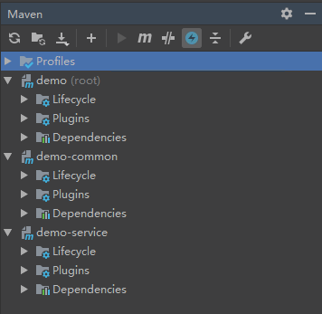

# 创建多模块项目

## 1 创建主工程 demo

1. 选择 File -> new -> Project，选择 Spring Initializr，创建主工程 demo。**注意: 不需要选择依赖项。**
2. 删除 demo 中的以下文件:
   - .mvn（文件夹）
   - src（文件夹）
   - .gitignore
   - mvnw
   - mvnw.cmd
3. 此时 demo 的 pom.xml 文件的内容如下:
   ```xml
   <modelVersion>4.0.0</modelVersion>
   <parent>
     <groupId>org.springframework.boot</groupId>
     <artifactId>spring-boot-starter-parent</artifactId>
     <version>2.5.1</version>
     <relativePath/> <!-- lookup parent from repository -->
   </parent>
   <groupId>com.example</groupId>
   <artifactId>demo</artifactId>
   <version>0.0.1-SNAPSHOT</version>
   <name>demo</name>
   <description>Demo project for Spring Boot</description>
   ```

## 2 创建子模块 demo-common（公共模块）

1. 选中主工程 demo -> 右键 -> New -> Module，选择 Maven
2. Parent 选择为主工程 demo
3. 输入模块名称 demo-common
4. 此时 demo-common 的 pom.xml 文件里自动生成的主要内容如下:
   ```xml
   <parent>
     <artifactId>demo</artifactId>
     <groupId>com.example</groupId>
     <version>0.0.1-SNAPSHOT</version>
   </parent>
   <modelVersion>4.0.0</modelVersion>

   <artifactId>demo-common</artifactId>
   ```
5. 此时 demo 的 pom.xml 文件里自动生成的内容如下:
   ```xml
   <packaging>pom</packaging>
   <modules>
     <module>demo-common</module>
   </modules>
   ```
6. 在 demo 的 pom.xml 文件里添加 demo-common 依赖
   ```xml
   <dependencyManagement>
     <dependencies>
         <dependency>
             <groupId>com.example</groupId>
             <artifactId>demo-common</artifactId>
             <version>0.0.1-SNAPSHOT</version>
         </dependency>
     </dependencies>
   </dependencyManagement>
   ```

## 3 创建子模块 demo-service

1. 选中主工程 demo -> 右键 -> New -> Module，选择 Maven
2. Parent 选择为主工程 demo
3. 输入模块名称 demo-service
4. 此时 demo-service 的 pom.xml 文件里自动生成的主要内容如下:
   ```xml
   <parent>
     <artifactId>demo</artifactId>
     <groupId>com.example</groupId>
     <version>0.0.1-SNAPSHOT</version>
   </parent>
   <modelVersion>4.0.0</modelVersion>

   <artifactId>demo-service</artifactId>
   ```
5. 此时 demo 的 pom.xml 文件里自动生成的内容如下:
   ```xml
   <packaging>pom</packaging>
   <modules>
     <module>demo-common</module>
     <module>demo-service</module>
   </modules>
   ```
6. 在 demo-service 的 pom.xml 文件里添加 demo-common 依赖
   ```xml
   <dependencies>
     <dependency>
         <groupId>com.example</groupId>
         <artifactId>demo-common</artifactId>
     </dependency>
   </dependencies>
   ```
7. 在 demo-service 的模块里添加包 com.example.demo.service
8. 在 demo-service 的模块里添加启动类
   ```java
   @SpringBootApplication
   public class DemoServiceApplication {
       public static void main(String[] args) {
           SpringApplication.run(DemoServiceApplication.class, args);
       }
   }
   ```

## 4 工程结构


## 5 Maven 结构


## 6 主工程和各子模块的 pom.xml 的详细配置
```xml
<!-- 主工程 demo 的 pom.xml 配置 -->
<?xml version="1.0" encoding="UTF-8"?>
<project xmlns="http://maven.apache.org/POM/4.0.0" xmlns:xsi="http://www.w3.org/2001/XMLSchema-instance"
         xsi:schemaLocation="http://maven.apache.org/POM/4.0.0 https://maven.apache.org/xsd/maven-4.0.0.xsd">
    <modelVersion>4.0.0</modelVersion>
    <packaging>pom</packaging>
    <modules>
        <module>demo-common</module>
        <module>demo-service</module>
    </modules>
    <parent>
        <groupId>org.springframework.boot</groupId>
        <artifactId>spring-boot-starter-parent</artifactId>
        <version>2.5.1</version>
        <relativePath/> <!-- lookup parent from repository -->
    </parent>
    <groupId>com.example</groupId>
    <artifactId>demo</artifactId>
    <version>0.0.1-SNAPSHOT</version>
    <name>demo</name>
    <description>Demo project for Spring Boot</description>
    <properties>
        <java.version>11</java.version>
        <spring-boot.version>2.5.1</spring-boot.version>
        <spring-cloud.version>2020.0.3</spring-cloud.version>
    </properties>
    <dependencyManagement>
        <dependencies>
            <!-- spring-boot -->
            <dependency>
                <groupId>org.springframework.boot</groupId>
                <artifactId>spring-boot-dependencies</artifactId>
                <version>${spring-boot.version}</version>
                <type>pom</type>
                <scope>import</scope>
            </dependency>

            <!-- spring-cloud -->
            <dependency>
                <groupId>org.springframework.cloud</groupId>
                <artifactId>spring-cloud-dependencies</artifactId>
                <version>${spring-cloud.version}</version>
                <type>pom</type>
                <scope>import</scope>
            </dependency>

            <!-- spring-boot-starter -->
            <dependency>
                <groupId>org.springframework.boot</groupId>
                <artifactId>spring-boot-starter</artifactId>
                <version>${spring-boot.version}</version>
            </dependency>

            <!-- spring-boot-starter-test -->
            <dependency>
                <groupId>org.springframework.boot</groupId>
                <artifactId>spring-boot-starter-test</artifactId>
                <version>${spring-boot.version}</version>
                <scope>test</scope>
            </dependency>

            <!-- demo-common 必须明确指定版本号, 以便动态修改依赖的版本号 -->
            <dependency>
                <groupId>com.example</groupId>
                <artifactId>demo-common</artifactId>
                <version>0.0.1-SNAPSHOT</version>
            </dependency>
        </dependencies>
    </dependencyManagement>

    <build>
        <pluginManagement>
            <plugins>
                <plugin>
                    <groupId>org.springframework.boot</groupId>
                    <artifactId>spring-boot-maven-plugin</artifactId>
                    <version>${spring-boot.version}</version>
                </plugin>
            </plugins>
        </pluginManagement>
    </build>

</project>
```

```xml
<!-- 子工程 demo-common 的 pom.xml 配置 -->
<?xml version="1.0" encoding="UTF-8"?>
<project xmlns="http://maven.apache.org/POM/4.0.0"
         xmlns:xsi="http://www.w3.org/2001/XMLSchema-instance"
         xsi:schemaLocation="http://maven.apache.org/POM/4.0.0 http://maven.apache.org/xsd/maven-4.0.0.xsd">
    <parent>
        <artifactId>demo</artifactId>
        <groupId>com.example</groupId>
        <version>0.0.1-SNAPSHOT</version>
    </parent>
    <modelVersion>4.0.0</modelVersion>

    <artifactId>demo-common</artifactId>

    <properties>
        <maven.compiler.source>12</maven.compiler.source>
        <maven.compiler.target>12</maven.compiler.target>
    </properties>

</project>
```

```xml
<!-- 子工程 demo-service 的 pom.xml 配置 -->
<?xml version="1.0" encoding="UTF-8"?>
<project xmlns="http://maven.apache.org/POM/4.0.0"
         xmlns:xsi="http://www.w3.org/2001/XMLSchema-instance"
         xsi:schemaLocation="http://maven.apache.org/POM/4.0.0 http://maven.apache.org/xsd/maven-4.0.0.xsd">
    <parent>
        <artifactId>demo</artifactId>
        <groupId>com.example</groupId>
        <version>0.0.1-SNAPSHOT</version>
    </parent>
    <modelVersion>4.0.0</modelVersion>

    <artifactId>demo-service</artifactId>

    <properties>
        <maven.compiler.source>12</maven.compiler.source>
        <maven.compiler.target>12</maven.compiler.target>
    </properties>

    <dependencies>
        <dependency>
            <groupId>org.springframework.boot</groupId>
            <artifactId>spring-boot-starter</artifactId>
        </dependency>

        <dependency>
            <groupId>org.springframework.boot</groupId>
            <artifactId>spring-boot-starter-test</artifactId>
        </dependency>

        <dependency>
            <groupId>com.example</groupId>
            <artifactId>demo-common</artifactId>
        </dependency>
    </dependencies>

    <build>
        <plugins>
            <plugin>
                <groupId>org.springframework.boot</groupId>
                <artifactId>spring-boot-maven-plugin</artifactId>
            </plugin>
        </plugins>
    </build>
</project>
```

## 7 附加

### 7.1 统一管理子模块的version

1. 父模块pom
   ```xml
    <parent>
        <groupId>org.springframework.boot</groupId>
        <artifactId>spring-boot-starter-parent</artifactId>
        <version>2.3.0.RELEASE</version>
        <relativePath/> <!-- lookup parent from repository -->
    </parent>
    <groupId>com.zhy</groupId>
    <artifactId>framework-root</artifactId>
    <version>1.0.0</version>
    <name>framework-root</name>
    <description>framework-root</description>
    <packaging>pom</packaging>

    <modules>
        <module>framework-service</module>
    </modules>
   ```
2. 在父模块中添加version插件
   ```xml
    <plugin>
         <groupId>org.codehaus.mojo</groupId>
         <artifactId>versions-maven-plugin</artifactId>
         <version>2.3</version>
         <configuration>
             <generateBackupPoms>false</generateBackupPoms>
         </configuration>
     </plugin>
   ```
3. 子模块pom，不要定义子模块的version
   ```xml
    <parent>
        <groupId>com.zhy</groupId>
        <artifactId>framework-root</artifactId>
        <version>1.0.0</version>
        <relativePath/> <!-- lookup parent from repository -->
    </parent>
    <groupId>com.zhy</groupId>
    <artifactId>framework-service</artifactId>
    <name>framework-service</name>
    <description>framework-service</description>
   ```
4. 在项目的根目录下执行以下命令:
   ```
   mvn versions:set -DnewVersion=2.0.0
   ```
5. 打包的时候，执行父模块的clean、package

### 7.2 出现与父模块同级的子模块X

1. 打开 File -> Project Structure -> Modules
2. 选中子模块X（正常情况下，子模块有且只有一个跟父模块目录相同的目录），删除跟父模块不同目录的子模块目录

### 7.3 pom.xml文件变为橙色

在父模块的pom.xml文件上单击鼠标右键，点击"And as Maven Project"即可。

### 7.4 IDEA Warning: Class 'Main' not found in module 'xxx'

1. 打开 File --> Project Structure --> Project Settings --> Project，将 Project SDK 修改为正确版本
2. 重启IDEA

### 7.5 在子模块中排除掉定义在父模块中的插件

- 如果是提供了 skip 功能的插件，就在子模块中把父模块插件的 skip 标签配置成 true
   ```xml
   <plugin>
      <groupId>org.springframework.boot</groupId>
      <artifactId>spring-boot-maven-plugin</artifactId>
      <configuration>
        <skip>true</skip>
      </configuration>
   </plugin>
   ```

- 如果是没有提供 skip 功能的插件，就在子模块里添加一个插件，覆盖掉父模块中的插件
   ```xml
   <plugin>
      <groupId>org.xxx</groupId>
      <artifactId>yyy-zzz-plugin</artifactId>
      <executions>
         <!-- phase设置成空 -->
         <execution>
            <phase/>
         </execution>
         <!-- 自定义一个不存在的id -->
         <execution>
            <id>自定义一个不存在的id</id>
         </execution>
      </executions>
   </plugin>
   ```
