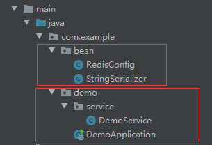
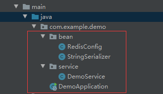
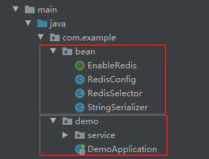

## 前言



```java
@Service
public class DemoService {
    @Autowired
    private RedisTemplate<String, Object> redisTemplate;
}
```

项目结构如上图所示，自定义的RedisTemplate的bean跟启动类不在同一个包内，然后运行，结果项目启动失败：

```
***************************
APPLICATION FAILED TO START
***************************

Description:

Field redisTemplate in com.example.demo.service.DemoService required a bean of type 'org.springframework.data.redis.core.RedisTemplate' that could not be found.

The injection point has the following annotations:
	- @org.springframework.beans.factory.annotation.Autowired(required=true)


Action:

Consider defining a bean of type 'org.springframework.data.redis.core.RedisTemplate' in your configuration.
```

对于springboot来说，它会把当前应用程序所在的包装载到ioc容器里，让使用者可以直接使用Autowired注入它们。

也就是说， **在项目启动的时候，springboot会扫描并注册启动类所在的包里面所有的bean。** 但此时的bean包，也就是 "com.example.bean" 不在启动类所在的包 "com.example.demo" 里，所以也就无法加载自定义的RedisTemplate的bean。

## 解决方法
### 1. 把bean包和启动类放入同一个包内



**如果bean包和启动类不在同一个包内，可采用方法2、3。**

### 2. 把bean包添加到启动类的扫描包的列表里
```java
@SpringBootApplication(scanBasePackages = {"com.example.bean"})
```

或者

```java
@SpringBootApplication(scanBasePackages = {"com.example"})
```

### 3. 用ImportSelector实现
#### 3.1 定义一个实现ImportSelector接口的RedisSelector类
```java
public class RedisSelector implements ImportSelector {
    @Override
    public String[] selectImports(AnnotationMetadata annotationMetadata) {
        return new String[]{RedisConfig.class.getName()};
    }
}
```

#### 3.2 定义Enable注解
```java
@Retention(RetentionPolicy.RUNTIME)
@Documented
@Target(ElementType.TYPE)
@Import(RedisSelector.class)
public @interface EnableRedis {
}
```

#### 3.3 在启动类上开启Enable注解
```java
@SpringBootApplication
@EnableRedis
public class DemoApplication {

    public static void main(String[] args) {
        SpringApplication.run(DemoApplication.class, args);
    }

}
```

项目结构如下图：


